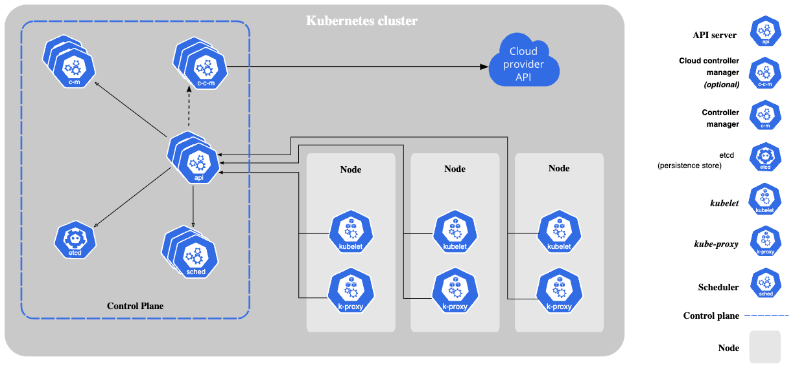
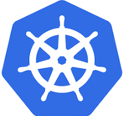
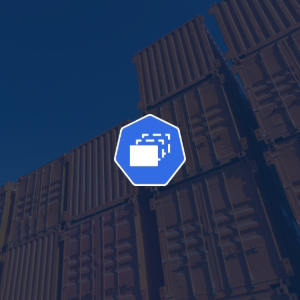
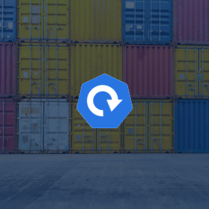

# Kubernetes for developers

In the current time, the K8s is the cloud’s S.O, I believe that all developers must know about infrastructure, they don’t need to be experts but to understand how to use tools like Kubernetes
This give me motivations to create a series in my plataform showing the theory and the practice how a k8s cluster works. 

## 01 - What is Kubernetes how can I use it ?

## 02 - Running First Application on Kubernetes

## 03 - Managing Pods Using Replicaset
]
## 04 - Deployment - More Control over of your applications

This series you can found on - https://www.programmingonmars.io/